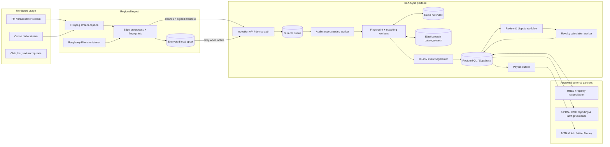
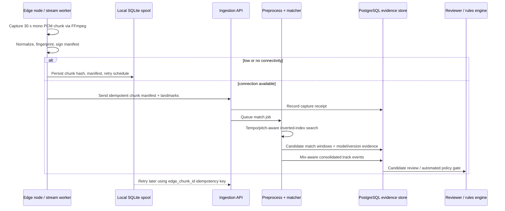
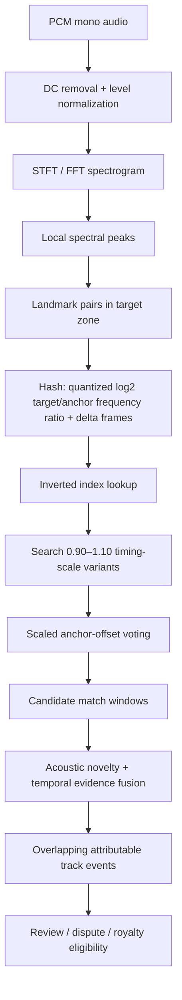
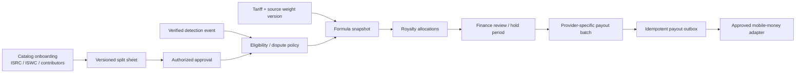
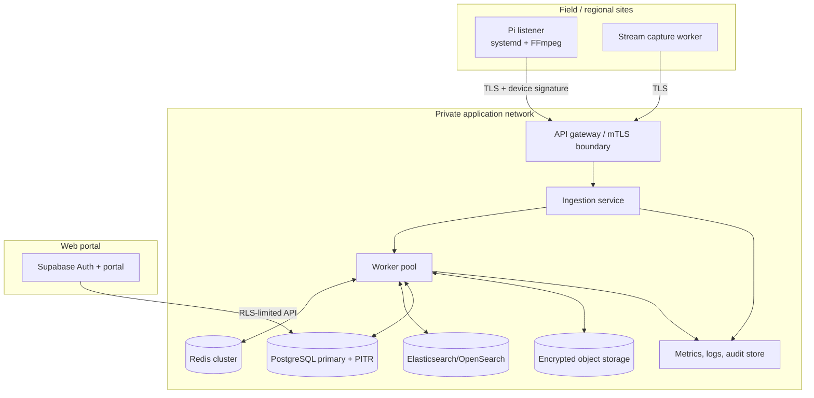

# KLA-Sync technical architecture

**Version:** foundation v0.1 · **Prepared:** 2026-09-01 · **Status:** implementation blueprint

KLA-Sync is an evidence-first music-usage platform for Uganda. It must identify
music in broadcast and informal-venue environments without assuming clean audio,
continuous connectivity, a single rights holder, or a single payment rail. A
match is *evidence*, not automatically a payable royalty event.

## Design principles

1. **Offline first at the edge.** Venue and taxi listeners continue collecting
   short chunks and compact hashes while MTN/Airtel cellular connectivity is
   absent or weak.
2. **Robust before fast.** Capture normalization, relative landmark hashes,
   tempo-aware alignment, and mix-aware event logic are required before latency
   optimization. Production matching is then served from an inverted index.
3. **Immutable financial evidence.** A payout snapshots the approved tariff,
   source weight, duration ratio, split line, and rounding decision that created
   it. Current catalog edits must not rewrite a prior settlement.
4. **Separation of duties.** Catalog editing, detection review, finance approval,
   and telecom dispatch have different roles and audit events.
5. **No fabricated integrations.** URSB and telecom connectivity are enabled
   only after approved data-sharing/commercial agreements and sandbox
   certification. Adapters are contracts until then.

## System context



## Capture-to-attribution flow



### Edge behavior

| Concern | Required behavior |
| --- | --- |
| Cellular outage | SQLite outbox survives reboot; it records chunk hash, timestamps, and upload state. It does not discard unacknowledged evidence. |
| Low bandwidth | Default upload is fingerprint landmarks and signed manifests. Upload encrypted source audio only under explicit retention/consent policy or review request. |
| Stream instability | FFmpeg reconnect flags, bounded segment files, systemd restart policy, and health heartbeat are used. Stream URLs must never be written to logs. |
| Device trust | Provision a unique device public key and rotate/revoke it; accept signed manifests only from active nodes. |
| Disk pressure | Monitor queued bytes; use a policy-approved retention/quarantine flow rather than silently deleting evidence. Alert before capacity exhaustion. |
| Clock drift | Include device clock, server receipt time, and NTP health. Correct timelines server-side with a recorded offset; never overwrite source timestamps. |

The reference `EdgeSpool` and `build_ffmpeg_capture_command` implementation is
in `src/kla_sync/ingestion/edge.py`. It is intentionally a local queue contract,
not a daemon supervisor.

## Fingerprinting and DJ-mix attribution



### Why this accommodates DJ manipulation

Traditional landmark systems often include absolute anchor and target frequency
bins. A uniform pitch shift changes both and breaks an exact key. KLA-Sync's
reference key quantizes this interval instead:

```text
ratio_bin = round(log2((target_bin + 0.5) / (anchor_bin + 0.5)) * 48)
delta_frames = target_frame - anchor_frame
```

A uniform pitch adjustment approximately preserves `ratio_bin`. At query time,
KLA-Sync searches `delta_frames × {0.90 … 1.10}` and votes on a scaled timeline
offset. This is a **candidate-generation** technique; thresholds must be
calibrated with labelled Kampala, Jinja, Mbarara, Gulu, club, taxi, and broadcast
material before it can approve payouts.

The `DJMixSegmenter` does not force a false hard cut during a beat-match. It
combines acoustic novelty (flux, level, centroid changes) with repeated matcher
windows. Two tracks can validly overlap for a crossfade; the royalty policy must
state how that overlap is compensated and expose it in a report.

### Production matching-store contract

The reference in-memory index makes the durable contract explicit:

| Field | Meaning |
| --- | --- |
| `schema_id` | Hash algorithm and parameter fingerprint. Never mix schema versions. |
| `track_id` | Catalog recording UUID. |
| `ratio_bin`, `delta_frames` | Inverted-index key. |
| `anchor_frame` | Stored value used for alignment voting. |
| `matcher_version` | Service/model release persisted with every detection. |
| `vote_count`, coverage, scale, offset | Explainable candidate evidence. |

Use Redis for a hot shard keyed by `schema_id:ratio_bin:delta_frames`; use
Elasticsearch/OpenSearch for catalog discovery, diagnostics, and longer-lived
search. Partition both by fingerprint schema and shard consistently by hash key.
Do not expose an unbounded landmark-query endpoint to browsers.

## Catalog, rights, and payout flow



For every right type, the calculation is:

```text
Gross royalty = base rate × venue/station weight × detected duration / reference duration
Allocation     = gross royalty × split share (basis points / 10,000)
```

`src/kla_sync/royalties/calculator.py` uses `Decimal` arithmetic, validates that
active splits equal exactly 10,000 basis points, and applies largest-remainder
rounding so recipient payouts total the rounded gross amount in whole UGX.

### Rights model

- **Recording / master:** `recordings` stores the ISRC and links to a master
  split sheet for producer, label, performer, and other master-right recipients.
- **Composition:** `music_works` stores the ISWC and contributors; composition,
  performance, and mechanical split sheets are versioned separately.
- **Many-to-many links:** a recording can embody one or more works and a release
  can contain many recordings.
- **Versioning:** a split sheet is draft, active, superseded, or retired. A
  deferred database trigger rejects a committed active sheet that does not total
  100%. Past royalty allocations retain split snapshots.
- **Conflict handling:** ambiguous ISRC/ISWC claims, missing signatures, and
  overlapping mandate assertions stay out of automatic settlement until the
  designated CMO/rightsholder workflow resolves them.

## Deployment topology



Keep edge audio and all worker/admin APIs off the public browser plane. The
`002_supabase_rls.sql` migration is a starting policy baseline; sensitive
capture, payment, PII, and payout tables fail closed to browser clients. Apply a
penetration test and an access-control review before adding any portal view.

## Service boundaries and reliability targets

| Service | Owns | Idempotency boundary | Initial target |
| --- | --- | --- | --- |
| Capture agent | FFmpeg lifecycle, local spool | `edge_chunk_id` | 30-second chunks; store-and-forward on loss of network |
| Ingestion API | device auth, receipt, queue publish | `edge_chunk_id` / manifest digest | Ack only after durable receipt |
| Preprocess worker | decoding, loudness guardrails, chunk validation | capture ID + processing version | deterministic retry; quarantine malformed files |
| Matcher | fingerprint extraction, lookup, candidate windows | capture ID + matcher version | p95 sub-50 ms **lookup only** after hashes are available; measure end-to-end separately |
| Segmenter | match-window fusion, overlap marking | capture/session + segmenter version | preserve raw evidence and model inputs |
| Catalog/rights service | ISRC/ISWC, contributors, split approvals | external registry record ID | exact 10,000 bp active split validation |
| Royalty worker | formula snapshots, allocations | run + detection + right type | rerunnable with identical inputs |
| Payout dispatcher | approved outbox + provider status | payout idempotency UUID | no duplicate hand-off after timeout |

The sub-50 ms requirement is realistic only for a warmed, partitioned matching
lookup. It excludes microphone capture, FFT extraction, network travel, queueing,
and review. Track and publish each latency separately.

## Security, privacy, and governance controls

- **Audio minimization:** hashes/manifests are the default retention unit.
  Encrypted raw clips require a defined purpose, access log, retention period,
  and deletion workflow.
- **Secrets:** device private keys, object-store keys, URSB credentials, and
  telecom credentials live in a secret manager. `.env.example` documents names,
  never values.
- **Wallet privacy:** only ciphertext, a keyed HMAC for duplicate detection, a
  key reference, and optional last four digits are stored. Never log full wallet
  numbers or provider tokens.
- **Financial safety:** candidate detections, disputed works, inactive/partial
  splits, unverified payment accounts, and unapproved tariff versions cannot
  enter a payout batch.
- **Auditability:** write append-only audit events for catalog edits, split
  activation, reviewer decisions, tariff/weight changes, calculation runs, and
  provider callbacks.
- **Data governance:** obtain legal advice on Uganda's applicable data-protection,
  telecommunications, copyright, consent, and cross-border processing
  obligations. The platform design is not legal advice.

## Delivery phases

1. **0 — controlled data foundation:** onboarding templates, approved test
   catalog, migration review, device identity, and a labelled audio corpus.
2. **1 — radio pilot:** 4–8 agreed streams across Kampala, Jinja, Mbarara, and
   Gulu; shadow reports only; manually review false positives/negatives.
3. **2 — venue pilot:** 10–20 consented venues/taxis with offline nodes; measure
   bandwidth, uptime, noise, DJ manipulation, and consent workflows.
4. **3 — settlement sandbox:** frozen tariffs/splits, dry-run statements,
   recipient reconciliation, approved telecom sandbox, and dispute simulations.
5. **4 — controlled production:** phased station/venue onboarding, payout caps,
   dual approval, incident runbooks, and independent reconciliation.

## Acceptance metrics for a pilot

- Precision/recall by source class, language/genre, pitch range, tempo range,
  SNR, and track popularity — not one blended headline number.
- Candidate-match latency, queue delay, raw processing time, and online uptime.
- Edge backlog age/bytes and successful delayed upload rate.
- Percentage of active splits that validate to exactly 10,000 bp.
- Detection-to-statement reconciliation rate and payout callback reconciliation
  rate.
- Dispute volume, resolution time, and corrected amount before payout.

See [`autonomous-service-prompts.md`](autonomous-service-prompts.md) for
agent-worker operating prompts and
[`uganda-go-to-market-and-partnership.md`](uganda-go-to-market-and-partnership.md)
for the Uganda partnership plan.
