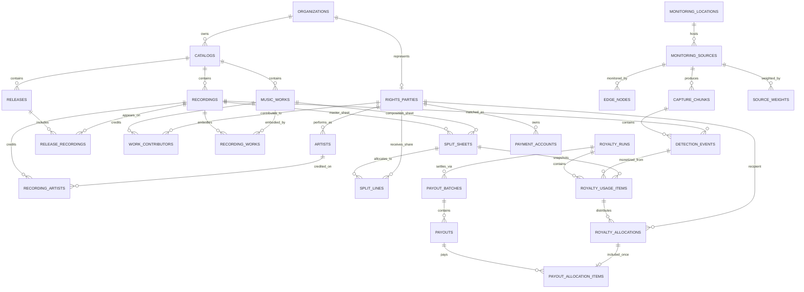
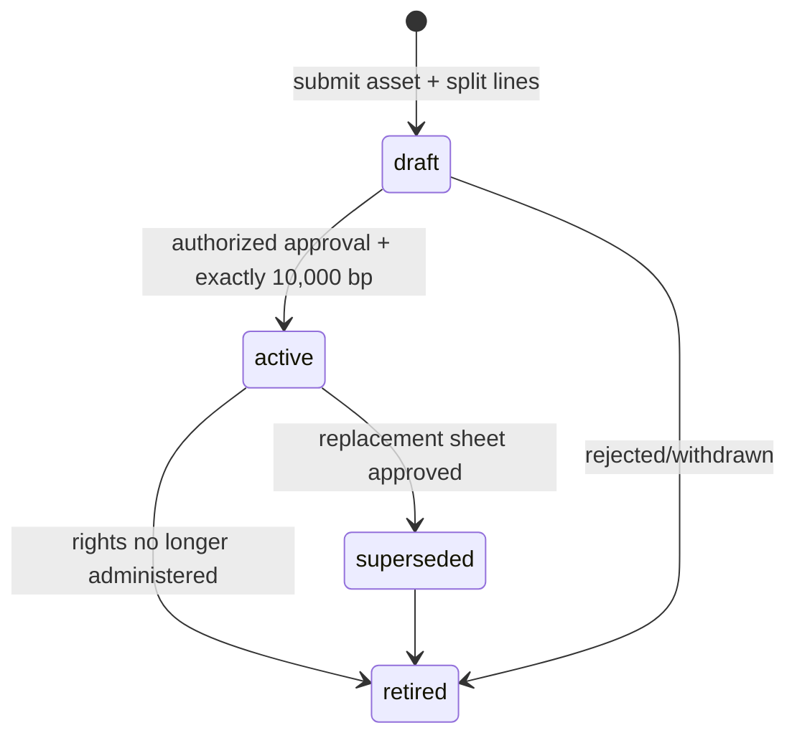
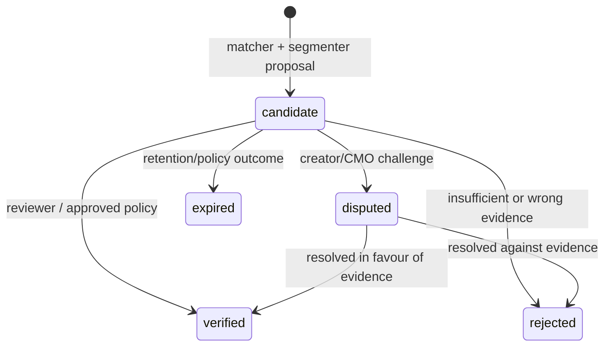
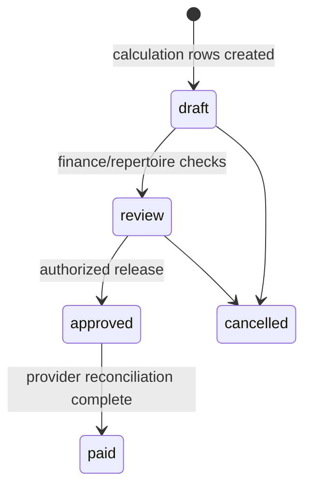

# KLA-Sync catalog, rights, and settlement data model

The executable schema is [`001_core_schema.sql`](../migrations/001_core_schema.sql)
plus [`003_integrity_guards.sql`](../migrations/003_integrity_guards.sql);
[`002_supabase_rls.sql`](../migrations/002_supabase_rls.sql) adds the optional
Supabase Auth policy baseline. This document explains the important
relationships and invariants for product, legal, finance, and database reviewers.

## Entity relationship map



## Identifier model

| Business object | Primary technical key | Industry identifier | Rule |
| --- | --- | --- | --- |
| Sound recording | `recordings.id` UUID | ISRC | Globally unique when present; normalized upper case and regex checked |
| Musical work/composition | `music_works.id` UUID | ISWC | Globally unique when present; normalized `T-000.000.000-0` format |
| Release | `releases.id` UUID | UPC/EAN optional | Unique inside catalog when present |
| Creator/publisher/label | `rights_parties.id` UUID | approved external reference optional | A party may be an individual or an organization; no inference from a stage name |
| Field capture | `capture_chunks.id` UUID | `edge_chunk_id` UUID | Edge ID is unique and makes retry safe |
| Candidate/verified play | `detection_events.id` UUID | idempotency UUID | Match evidence carries matcher/schema/version metadata |
| Provider payment | `payouts.id` UUID | idempotency UUID + provider reference | One durable outbox record, never a blind retry |

ISRC/ISWC validation checks syntax, **not ownership**. Rights ownership remains
an approved catalog/CMO/legal workflow with registry provenance where authorized.

## Split-sheet lifecycle



Each sheet owns one asset/right pairing:

- `master` → exactly one `recording_id`;
- `composition`, `performance`, `mechanical` → exactly one `work_id`;
- each line uses an integer `share_basis_points` value;
- an active sheet requires `approved_at`; and
- the deferred trigger rejects an active sheet that does not total exactly
  10,000 basis points at transaction commit.

A replacement does not mutate a historic allocation. The royalty calculation
stores split line, party, role, share, raw amount, and settled amount snapshots.

### Example: safe split activation transaction

```sql
BEGIN;

-- Create as draft, insert every line, attach signed source-document key.
INSERT INTO split_sheets (
  catalog_id, recording_id, right_type, version, status,
  valid_from, source_document_key, approved_at, approved_by_party_id
) VALUES (
  :catalog_id, :recording_id, 'master', 1, 'active',
  CURRENT_DATE, :document_key, now(), :approver_party_id
) RETURNING id;

INSERT INTO split_lines (split_sheet_id, party_id, role, share_basis_points)
VALUES
  (:sheet_id, :producer_party_id, 'producer', 5000),
  (:sheet_id, :artist_party_id,   'performer', 3000),
  (:sheet_id, :label_party_id,    'label',     2000);

-- Optional early validation; it would otherwise run automatically at COMMIT.
SET CONSTRAINTS split_lines_total_check, split_sheets_total_check IMMEDIATE;
COMMIT;
```

Do not activate the new sheet until any mandate/dispute workflow agrees its
validity interval. The base migration version-controls sheets but deliberately
leaves detailed contractual-overlap policy to the rights governance service.

## Detection evidence lifecycle



A `detection_events` row includes:

- capture/source IDs and absolute observed timestamps;
- matched recording UUID;
- query duration, landmark vote count, confidence, timing scale, and matcher
  version; and
- review status/note/timestamp.

Use a separate session/event layer in the application when a 1–2-hour DJ set
spans many chunks. The reference segmenter preserves overlap information so the
application can apply an approved overlap rule before setting a detection to
`verified`.

## Settlement lifecycle and invariants



`royalty_usage_items` snapshots the formula inputs:

```text
Gross = base_rate_ugx × source_weight × duration_ratio
```

`royalty_allocations` snapshots one split result per split line. Deferred
database triggers reject an `approved` or `paid` run where a usage item's
allocation sum differs from `gross_settled_ugx`, and reject a dispatched payout
whose amount differs from its allocation items. Cross-table guards also verify
that a detection, run, split sheet, allocation line, recipient account, and
payout provider belong to the expected relationship. The Python calculator
rounds with a largest-remainder method so the database invariant is achievable.

Payment is separate from calculation:

1. `payment_accounts` has a verified provider-specific encrypted reference;
2. `payout_batches` groups approved recipient obligations by provider;
3. `payouts` has a globally unique idempotency key; and
4. `payout_outbox` records durable dispatch/retry state before any provider call.

Never change a payout to paid solely because an HTTP request returned. Reconcile
an authenticated provider callback/status lookup against its idempotency key and
record the provider reference.

## Effective-date lookup pattern

The calculation worker must choose a tariff, source weight, and active split
that were in force when the usage happened. A simplified source-weight lookup:

```sql
SELECT weight, rationale, approved_at
FROM source_weights
WHERE source_id = :source_id
  AND valid_from <= (:observed_at AT TIME ZONE 'Africa/Kampala')::date
  AND (valid_to IS NULL OR valid_to >= (:observed_at AT TIME ZONE 'Africa/Kampala')::date)
ORDER BY valid_from DESC
LIMIT 1;
```

`source_weights_no_overlap` prevents ambiguous effective periods for the same
source. Add an equivalent mutually-exclusive tariff policy in the tariff
administration service before settlement: differing `source_type` specificity
needs a documented precedence rule, not accidental SQL ordering.

## Supabase access model

`002_supabase_rls.sql` adds membership roles and enables RLS. Browser users can
read their catalog scope and reviewed financial rows as allowed by policy;
catalog editors can prepare draft split sheets but cannot turn a draft active,
and financial values are server-workflow write-only. Sensitive capture, payment,
PII, and operational tables have RLS enabled with no browser policies. Backend
worker access should use a server-only role with narrow grants, not a key
embedded in a web/mobile app.

Before using the RLS migration in production:

1. review role names and bootstrap procedure with the identity owner;
2. add redact-only portal views/RPCs rather than opening base tables;
3. test user A vs. user B tenant isolation and service-role boundaries; and
4. add append-only audit/WORM retention controls appropriate to the agreed
   financial and privacy requirements.

## Retention and minimization notes

- `capture_chunks` records integrity and policy even if no raw audio is kept.
- `encrypted_object_key` is permitted only for `encrypted_audio` policy.
- Registry rows retain a digest/provenance and status, not a fabricated external
  API response.
- Wallet values are ciphertext + HMAC + key reference, never plaintext MSISDN.
- The schema is an application foundation; legal retention periods, deletion
  holds, and regional data-transfer requirements must be agreed before launch.
