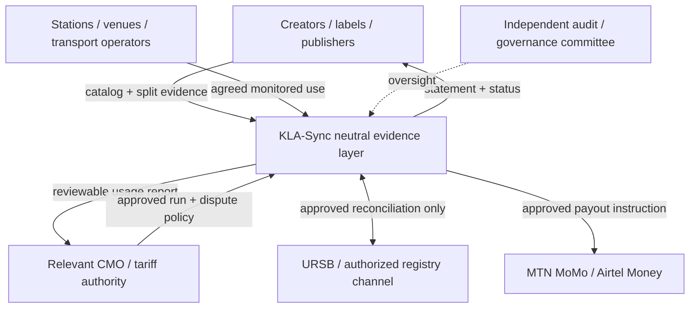

# KLA-Sync Uganda go-to-market and partnership concept paper

**Working draft — 2026-09-01**
**Audience:** Ugandan rightsholders, collective-management stakeholders,
broadcasters, venues, telecom partners, and implementation funders.

> This is a partnership and operating proposal, not legal advice and not a
> representation that any named institution has approved KLA-Sync. Confirm the
> current mandate, data-access process, tariff authority, licensing position,
> and API/sandbox availability with each institution before making a public
> claim or processing production data.

## 1. Executive proposition

KLA-Sync gives the Ugandan music ecosystem a defensible way to turn observed
music use into transparent evidence, royalty statements, and—after approval—
local mobile-wallet payouts. It is designed for the realities that generic clean
audio-monitoring products often miss:

- radio and DJ playback with pitch shifts, tempo adjustments, voiceovers,
  beat-matching, and noisy rooms;
- venues and taxi routes with intermittent, expensive cellular data;
- recordings and compositions with several producers, writers, artists,
  publishers, administrators, and changing split sheets; and
- creators who need understandable, timely payments through familiar local
  wallet rails.

The initial commercial promise is **better evidence and reconciliation**, not a
claim of perfect surveillance or immediate automatic payout. Shadow reporting,
co-design, and independently auditable pilots are prerequisites to settlement.

## 2. Stakeholder value exchange

| Stakeholder | KLA-Sync value | What KLA-Sync needs from the stakeholder |
| --- | --- | --- |
| Creators, producers, labels, publishers | Visibility into observed plays, split onboarding, disputes, and statements in plain language | Rights evidence, accurate ISRC/ISWC metadata, consented onboarding, correction feedback |
| Relevant CMO(s), including UPRS where mandate is confirmed | Better usage evidence, reconciliation export, auditable allocation inputs, regional reporting | Mandate/tariff governance, dispute policy, data-sharing agreement, pilot review team |
| URSB and other authorized registry counterparts | Structured registry-reconciliation requests and provenance, rather than copied opaque data | Approved lookup rules, permitted fields, retention/security conditions, escalation path |
| Radio/broadcasters | Lower-friction usage logs, evidence of local repertoire support, operational dashboard | Agreed stream access, schedule/playlist reconciliation, pilot feedback |
| Clubs, bars, hotels, taxi/operator associations | Low-bandwidth listener option and aggregate compliance evidence | Consent, safe node placement, venue category/operating hours, local support contact |
| MTN MoMo / Airtel Money | A controlled, auditable disbursement use case with provider-specific reconciliation | Commercial agreement, sandbox/certification, callback/SLA requirements, fraud controls |
| Regulators and cultural-sector partners | Transparent methodology, aggregate local-content insights, traceable governance | Advice on lawful processing, appropriate safeguards, and feedback mechanisms |

## 3. Product-market wedge

### Start with a radio shadow-reporting pilot

Radio streams are the lowest-friction first source: capture is centralized,
metadata can be reconciled against station logs, and coverage can include
Kampala, Jinja, Mbarara, and Gulu without deploying field hardware everywhere.
The pilot output is a **non-financial weekly reconciliation report**:

1. observed candidate plays by station and time;
2. matched catalog identity, confidence, and manipulation indicators;
3. station playlist/log agreement and exceptions;
4. unmatched local repertoire candidates for catalog outreach; and
5. false-positive/false-negative review outcomes.

Only once error rates, governance, and tariff interpretation are accepted should
usage feed a dry-run statement.

### Expand to consented venues and mobility pilots

The second wedge is a limited set of clubs/bars and, if operator consent and
safety review permit, taxi/mobility environments. A Raspberry Pi listener stores
short local capture references and fingerprints offline, then uploads compact
manifests when a cellular connection returns. Do **not** treat a microphone as a
license to collect indefinitely: physical notice, operator agreement, retention
limits, and access controls are part of the product.

### Build the catalog flywheel

Offer no-cost or subsidized onboarding during the pilot for high-quality local
catalog data:

- recording title, performer, producer, label, duration, and ISRC where issued;
- composition title, writers/composers/publishers, and ISWC where assigned;
- signed or otherwise evidenced splits in integer basis points;
- payment-recipient verification; and
- audio reference delivery for fingerprint enrollment.

An onboarding team must be able to resolve aliases, spelling variants, Luganda
and other language titles, transliteration, and artist-stage-name collisions.

## 4. Partnership architecture

### Proposed role boundaries

- **KLA-Sync:** technical evidence processor, catalog workflow operator, and
  statement-calculation service under documented rules. It does not unilaterally
  redefine rights, mandates, tariffs, or licensing obligations.
- **CMO/rightsholder governance body:** approves repertoire scope, policy,
  tariff/version, exceptions, dispute rules, and payout-release authority.
- **URSB/authorized registry channel:** supplies or validates only the metadata
  and workflow permitted by an executed agreement. KLA-Sync retains provenance,
  not an unauthorized copy of registry data.
- **Stations/venues/operators:** provide consented access and can reconcile
  operational logs; they are not expected to manually tag every DJ track.
- **Telecom providers:** process an approved, idempotent payment instruction
  through the provider’s certified flow. KLA-Sync reconciles callbacks and does
  not store telecom secrets in client devices.

## 5. Proposed CMO / URSB engagement sequence

### Stage A — discovery and safeguards (weeks 0–6)

1. Identify the legally authorized counterpart(s) for each right type and pilot
   repertoire; obtain written confirmation of decision makers.
2. Hold a workflow mapping session: licensing → observation → matching → review
   → dispute → tariff → allocation → payout → reconciliation.
3. Agree what KLA-Sync may receive, store, display, export, and retain. Record
   lawful basis/consent roles and data-controller/processor responsibilities.
4. Establish a joint technical and business steering group, including creator
   representation and an independent audit observer.
5. Create a test-data agreement; do not use live wallet data or production
   registry credentials at this stage.

### Stage B — controlled shadow pilot (weeks 7–18)

1. Enroll an agreed reference catalog and archive the version used for testing.
2. Monitor agreed radio streams; compare with station logs and human listening
   samples.
3. Measure precision/recall by genre, language, pitch/tempo range, source class,
   and signal quality. Publish methodology and sample size to the steering group.
4. Trial catalog dispute/split correction workflows with non-financial results.
5. Complete security assessment, data-retention review, and financial-control
   design.

### Stage C — dry-run settlement (weeks 19–26)

1. Freeze a tariff/version, source weights, repertoire scope, and split cut-off.
2. Produce statements without moving funds; reconcile totals with the CMO and
   participating rightsholders.
3. Run dispute simulations, split-change simulations, duplicate-payment tests,
   and provider callback failures.
4. Obtain written go/no-go criteria from governance parties before enabling any
   limited payout pilot.

### Stage D — controlled production

Use payout limits, dual approval, provider sandbox-to-production certification,
exception queues, and periodic independent reconciliation. Expand geography and
venue classes only after source-specific metrics remain within the agreed range.

## 6. Commercial model options

Start with a transparent pilot budget rather than a percentage claim that could
conflict with mandate or tariff rules.

| Model | Appropriate use | Safeguard |
| --- | --- | --- |
| Pilot implementation fee | Initial station/catalog onboarding, devices, calibration, training | Deliverables, source count, support hours, and data ownership specified in SOW |
| Per monitored source/month | Mature station/venue operations | Tier by capture uptime and source class, not by opaque match volume |
| Per verified usage / statement fee | CMO-managed settlement processing | Publish calculation and caps; never create incentives to over-match |
| Shared infrastructure / grant model | Public-interest local-repertoire coverage | Governance committee, open methodology summaries, sustainability plan |
| Device lease + support | Venue node deployment | Clear loss, maintenance, cellular-data, and consent terms |

A commercial agreement should explicitly state who bears cellular costs, device
replacement, raw-audio retention, dispute support, provider transaction fees,
and chargeback/reversal costs.

## 7. Trust, privacy, and creator protections

1. **Visible evidence:** statements show source, timestamps, match evidence,
   duration, source weight, tariff version, split version, rounding, and payout
   status—not just a final number.
2. **Challenge path:** a rightsholder can flag an incorrect identity, duration,
   source, split, payment account, or mandate. The disputed amount is held, not
   silently redistributed.
3. **Data minimization:** transmit hashes/manifests by default. Encrypt any
   policy-approved clip, restrict access, and enforce a documented deletion
   schedule.
4. **Venue transparency:** pilot locations receive a listener notice and contact
   path. No covert microphone deployment.
5. **Financial controls:** verified recipient account, dual approval, immutable
   calculation snapshot, idempotent payout ID, callback reconciliation, and
   exception review are mandatory.
6. **Bias monitoring:** evaluate recall for less-promoted local catalog, regional
   languages, older recordings, female creators, and emerging artists—not only
   high-quality studio masters.

## 8. Telecom payout readiness checklist

Before production enablement for either provider, obtain and test:

- executed commercial and technical agreements for the exact Uganda product;
- approved sandbox credentials and a production go-live checklist;
- recipient verification/KYC rules and responsibility matrix;
- OAuth/key rotation, IP/mTLS requirements, callback signing, and replay defense;
- idempotency and lookup behavior after a timeout or duplicate callback;
- transaction limits, fees, settlement/cut-off times, reversal/refund behavior;
- status taxonomy and reconciliation-file/API cadence;
- fraud, AML/CFT, privacy, breach, and customer-support escalation procedures;
- provider outage runbook and a payout-hold policy; and
- an end-to-end test for accepted, pending, failed, duplicate, reversed, and
  unknown outcomes.

The repository exposes provider-neutral `PayoutInstruction` and `PayoutOutbox`
concepts. It deliberately does not guess a live MTN or Airtel endpoint.

## 9. Pilot scorecard and go/no-go gates

| Category | Illustrative gate | Evidence |
| --- | --- | --- |
| Match quality | Source-specific precision/recall thresholds agreed in advance | Blinded, labelled listening set and station-log comparison |
| Uptime | Capture/backlog SLA by source type | Device heartbeat, spool age, stream reconnect records |
| Catalog readiness | Every payable asset has approved rights/split evidence | Split validation and exception report |
| Financial accuracy | Statement totals reconcile to immutable inputs | Recomputed sample and independent review |
| Disputes | Acknowledgement/resolution SLAs met in dry run | Ticket/audit trail |
| Privacy/security | No unresolved critical findings | Threat model, access review, penetration-test findings |
| Telecom | Full lifecycle certification passes | Sandbox records and reconciliation results |
| Governance | Written release approval | Steering-group decision record |

Set numerical values jointly during discovery; publishing an arbitrary universal
threshold before a local corpus exists would be misleading.

## 10. 90-day launch plan

| Window | Outcomes |
| --- | --- |
| Days 1–15 | Stakeholder map, counterpart confirmations, draft data/consent map, radio pilot shortlist, reference implementation review |
| Days 16–30 | Pilot MoU/SOW draft, security architecture review, test catalog template, labelled-audio collection protocol, device procurement plan |
| Days 31–45 | Catalog onboarding clinic, stream capture setup, matcher calibration baseline, dashboard/report prototype, staff training |
| Days 46–60 | Shadow monitoring, weekly reconciliation, edge-node lab test, error taxonomy, creator feedback sessions |
| Days 61–75 | Expand agreed sources, run split/dispute simulations, tariff/source-weight workshop, telecom sandbox discovery |
| Days 76–90 | Pilot evaluation, independent sample audit, production-readiness gap list, jointly signed decision on dry-run settlement |

## 11. Draft memorandum-of-understanding headings

1. Parties, purpose, pilot period, and territory.
2. Defined roles: controller/processor, repertoire administrator, reviewer,
   settlement approver, device host, and support contact.
3. Authorized source list, capture method, notice/consent, and exclusion list.
4. Data fields, security controls, retention/deletion, audit rights, and
   cross-border processing rules.
5. Catalog submission, ISRC/ISWC validation, split evidence, correction SLAs,
   and ownership of enriched metadata.
6. Matching methodology, benchmark corpus, confidence/review policy, and
   treatment of DJ mixes/overlaps.
7. Tariff/source-weight governance, calculation versioning, payout holds,
   disputes, and reconciliation.
8. Commercial terms, cellular/device costs, provider fees, taxes, and reporting.
9. Intellectual property, confidentiality, publicity/brand use, and no implied
   endorsement.
10. Incident response, liability, termination, data return/deletion, and dispute
    escalation.

## 12. Creator-facing message (plain-language draft)

> KLA-Sync helps show where participating music is heard on agreed radio and
> venue sources. We use music fingerprints and review rules to make a report;
> a fingerprint match is checked before it becomes a payment. Your statement
> will show the play evidence, tariff, split, and payment status. If a song,
> split, or wallet is wrong, you can raise a dispute and the affected amount is
> held while it is reviewed.

## 13. Immediate decisions requested

1. Which institution(s) should co-design the initial radio shadow pilot?
2. Which repertoire/right categories are in scope for the first non-financial
   report?
3. What approved source list, consent language, and retention policy are
   acceptable for a 90-day pilot?
4. Who has authority to approve tariffs, source weights, and release of a
   dry-run statement?
5. What independent technical/creator representatives should sit on the steering
   group?

Answering these five questions converts this concept paper into a scoped pilot
rather than an unbounded technology project.
